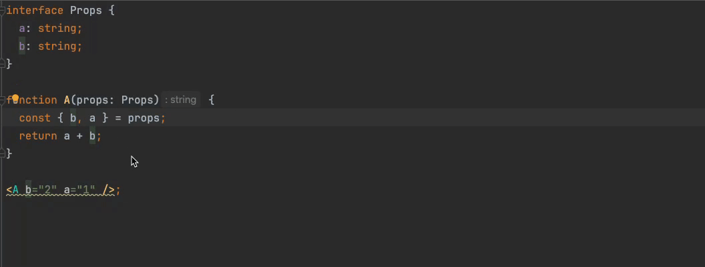

# eslint-plugin-sort-destructure-keys-typescript

[![npm version][npm-version-src]][npm-version-href]
[![npm downloads][npm-downloads-src]][npm-downloads-href]

ESLint plugin rules to sort destructure keys and JSX attributes by TypeScript type order.
The plugin requires `parserServices` to be generated.
You must therefore provide a value for the `parserOptions.project` property for `@typescript-eslint/parser`.



[Rules List](./src/rules)

## Configuration

```shell
pnpm add -D eslint-plugin-sort-destructure-keys-typescript
```

Add to your `eslint.config.js`

```js
import typescriptEslintParser from "@typescript-eslint/parser";
import sortDestructureKeysConfig from "eslint-plugin-sort-destructure-keys-typescript/config";

export default [
  // other settings...
  {
    // set up typescript-eslint
    languageOptions: {
      parser: typescriptEslintParser,
      parserOptions: {
        project: true,
        tsconfigRootDir: import.meta.dirname,
      },
    },
  },
  sortDestructureKeysConfig(),
];
```

## License

[MIT](./LICENSE) License © 2024-PRESENT [Nir Tamir](https://github.com/nirtamir2)

<!-- Badges -->

[npm-version-src]: https://img.shields.io/npm/v/eslint-plugin-sort-destructure-keys-typescript?style=flat&colorA=080f12&colorB=1fa669
[npm-version-href]: https://npmjs.com/package/eslint-plugin-sort-destructure-keys-typescript
[npm-downloads-src]: https://img.shields.io/npm/dm/eslint-plugin-sort-destructure-keys-typescript?style=flat&colorA=080f12&colorB=1fa669
[npm-downloads-href]: https://npmjs.com/package/eslint-plugin-sort-destructure-keys-typescript

### Thanks

- https://github.com/antfu/eslint-plugin-antfu for a starter project
- https://github.com/antfu/eslint-plugin-command for a starter project
- https://github.com/JoshuaKGoldberg/eslint-plugin-package-json for a starter project
- https://github.com/mthadley/eslint-plugin-sort-destructure-keys - for ordering
