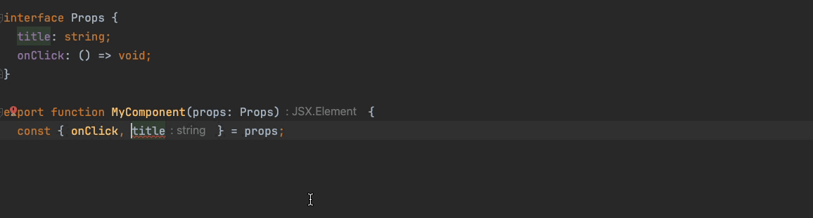

# eslint-plugin-sort-destructure-keys-typescript

[![npm version][npm-version-src]][npm-version-href]
[![npm downloads][npm-downloads-src]][npm-downloads-href]

ESLint plugin rules to sort destructure keys by typescript type order.
This rule requires `parserServices` to be generated. You must therefore provide a value for the "parserOptions.project" property for `@typescript-eslint/parser`.



[Rules List](./src/rules)

## Configuration

```shell
pnpm add -D eslint-plugin-sort-destructure-keys-typescript
```

Add to your `eslint.config.js`

```js
export default {
  files: ["**/*.?([cm])tsx", "**/*.?([cm])ts"],
  languageOptions: {
    parserOptions: {
      project: true,
      tsconfigRootDir: import.meta.dirname,
    },
  },
  plugins: {
    "sort-destructure-keys-typescript": sortDestructureKeysPlugin,
  },
  rules: {
    "sort-destructure-keys-typescript/sort-destructure-keys-by-type": "error",
    // "sort-destructure-keys-typescript/sort-destructure-keys-by-type": [
    //   "error",
    //   { onlyTypes: ["Props"] },
    // ],
    // "sort-destructure-keys-typescript/sort-destructure-keys-by-type": [
    //   "error",
    //   { ignoreTypes: ["TypeToIgnore"] },
    // ],
  },
};
```

## License

[MIT](./LICENSE) License © 2024-PRESENT [Nir Tamir](https://github.com/nirtamir2)

<!-- Badges -->

[npm-version-src]: https://img.shields.io/npm/v/eslint-plugin-sort-destructure-keys-typescript?style=flat&colorA=080f12&colorB=1fa669
[npm-version-href]: https://npmjs.com/package/eslint-plugin-sort-destructure-keys-typescript
[npm-downloads-src]: https://img.shields.io/npm/dm/eslint-plugin-sort-destructure-keys-typescript?style=flat&colorA=080f12&colorB=1fa669
[npm-downloads-href]: https://npmjs.com/package/eslint-plugin-sort-destructure-keys-typescript

### Thanks

- https://github.com/antfu/eslint-plugin-antfu for starter project
- https://github.com/mthadley/eslint-plugin-sort-destructure-keys - for ordering
